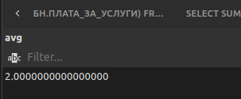

# BDLab2024_3

## Выполнение заданий на SQL

### Задание

- Для удобства просмотра, в секции **[выполнегого задания](#выполнения-заданий)** будет лежать само задание и его решение

---

## Решение

- Далее будут прилагаться скриншоты с результами выполнения задания
- SQL запрос для каждого задания лежит в папке ```/src``` для соответствующего уровня
- Начальные данные из задания **2.** лежат в ```data.txt```

# Выполнения заданий

## Уровень 1

## 1

**[SQL запрос](src/lvl1/1.sql)**

1. Дана схема базы данных в виде следующих отношений.  С помощью операторов SQL создать логическую структуру соответствующих таблиц для хранения в СУБД, используя известные средства поддержания целостности (NOT NULL, UNIQUE, и т.д.). Обосновать выбор типов данных и используемые средства поддержания целостности. При выборе подходящих типов данных использовать информацию о конкретных значениях полей БД 

### Дана схема базы данных:
- **НАНИМАТЕЛЬ**
  - ИДЕНТИФИКАТОР
  - НАЗВАНИЕ
  - МЕСТО РАСПОЛОЖЕНИЯ
  - ЛЬГОТА, %

- **БЮРО НАЙМА**
  - ИДЕНТИФИКАТОР
  - НОМЕР
  - АДРЕС КОНТОРЫ
  - ПЛАТА ЗА УСЛУГИ, %

- **ПРОФЕССИИ**
  - ИДЕНТИФИКАТОР
  - НАЗВ.
  - СТОИМОСТЬ НАЙМА, РУБ
  - КОЛ-ВО
  - МЕСТО ПРЕЖНЕЙ РАБОТЫ

- **ТРУДОВОЙ ДОГОВОР**
  - НОМЕР ДОГОВОРА
  - ДАТА
  - НАНИМАТЕЛЬ
  - БЮРО НАЙМА
  - ПРОФЕССИЯ
  - КОЛ-ВО
  - ОПЛАТА, РУБ

- До
  
<p align="center">
  
</p>

- После

<p align="center">
  
</p>

## 2

**[SQL запрос](src/lvl1/2.sql)**

2. Ввести в ранее созданные таблицы конкретные данные (```data.txt```). Использовать скрипт-файл из операторов INSERT или вспомогательную утилиту.

- До 

<p align="center">
  
</p>

- После

<p align="center">
  
</p>


## 3

**[SQL запрос](src/lvl1/3.sql)**

3. Используя оператор SELECT создать запрос для вывода всех строк каждой таблицы. Проверить правильность ввода. При необходимости произвести коррекцию значений операторами INSERT, UPDATE, DELETE. 

<p align="center">
  
</p>

## 4

**[SQL запрос](src/lvl1/4.sql)**

4. Создать запросы для вывода:
- названий всех нанимателей, вместе с местом их расположения;
- всех номеров бюро найма;
- всех различных предоставленных профессий вместе с их количеством.

<p align="center">
  
</p>

<p align="center">
  
</p>

<p align="center">
  
</p>

## 5

**[SQL запрос](src/lvl1/5.sql)**

5. Создать запросы для получения инорфмации о:
- названии и месте расположения нанимателей, имеющих льготу менее 8%;
- профессиях, имеющих стоиомость найма более 10000руб. для которых Москва не была местом прежней работы;
- Названиях  и расположении нанимателей, в названии которых присутствует слово “завод” и имеющих льготы. Вывод результатов организовать по названию и убыванию льгот.

<p align="center">
  
</p>

<p align="center">
  
</p>

<p align="center">
  
</p>


## 6

**[SQL запрос](src/lvl1/6.sql)**

6. Для каждого трудового договора вывести следующие данные:
- название нанимателя, дату, название бюро найма;
- дату, название бюро найма, название и количество заказанных профессий.

<p align="center">
  
</p>

<p align="center">
  
</p>

## 7

**[SQL запрос](src/lvl1/7.sql)**

7. Определить:
- дату, номер договора, название предприятий заказавших автоводителей или сделавших заказ на общую сумму не менее 14000руб.
- номера тех бюро найма вместе с адресами, которые предоставляли услуги организациям со льготами менее 7% после февраля месяца;
- предприятия, расположенные в любом городе, кроме Москвы, которые пользовались услугами бюро найма с платой за услуги более 3%;
- данные по заказу специальностей, у которых не изменился адрес работы. Включить данные о стоимости и отсортировать по возрастанию. 

<p align="center">
  
</p>

<p align="center">
  
</p>

<p align="center">
  
</p>

<p align="center">
  
</p>

## 8

**[SQL запрос](src/lvl1/8.sql)**

8. Создать запрос для модификации всех значений столбца с суммарной величиной оплаты заказа, чтобы он содержал истинную сумму, оплачиваемую нанимателем (с учетом льгот).

- До

<p align="center">
  
</p>

- После
  
<p align="center">
  
</p>

## 9

**[SQL запрос](src/lvl1/9.sql)**

9. Вывести новые значения.
- Расширить таблицу с данными о заказах столбцом, содержащим величину платы за услуги, получаемую бюро найма. Создать запрос для ввода конкретных значений во все строки таблицы покупок.

- До
  
<p align="center">
  
</p>

- После

<p align="center">
  
</p>

## Уровень 2

## 10

**[SQL запрос](src/lvl2/10.sql)**

10. Используя операцию IN (NOT IN)  реализовать следующие запросы:
- определить бюро найма, которые заключали договора с нанимателями из Н.Новгрода;
- найти профессии, которые не требовались нанимателям с размером льгот менее 10%;
- запросы заданий 7.1, 7.2.

<p align="center">
  
</p>

<p align="center">
  
</p>

<p align="center">
  
</p>

<p align="center">
  
</p>

## 11

**[SQL запрос](src/lvl2/11.sql)**

11. Используя операции ALL-ANY реализовать следующие запросы:
- на рабочих каких профессий заключались договора с максимальным количеством рабочих мест;
- найти нанимателя, заключившего самый дорогой договор с бюро найма из чужого города;
- запрос задания 7.3;

<p align="center">
  
</p>

<p align="center">
  
</p>

<p align="center">
  
</p>

<p align="center">
  
</p>

## 12

**[SQL запрос](src/lvl2/12.sql)**

12. Используя операцию UNION получить места расположения предприятий-заказчиков и бюро найма.

<p align="center">
  
</p>

## 13

**[SQL запрос](src/lvl2/13.sql)**

13. Используя операцию EXISTS ( NOT EXISTS ) реализовать нижеследующие запросы. В случае, если для текущего состояния БД запрос будет выдавать пустое множество строк, требуется указать какие добавления в БД необходимо провести.
- найти профессии, заказывавшиеся всеми предприятиями не из Приморска;
- найти такие бюро найма, которые участвовали в заключении договоров на все профессии со стоимостью найма более 15000руб.
- какие бюро найма не заключали договора на профессии, рабочие которых не изменили своего адреса работы;
- определить нанимателей, которые производили все заказы стоимостью не менее 100000руб. в апреле месяце.

<p align="center">
  
</p>

<p align="center">
  
</p>

<p align="center">
  
</p>

<p align="center">
  
</p>

## 14

**[SQL запрос](src/lvl2/14.sql)**

14. Реализовать запросы с использованием аггрегатных функций:
- определить средний размер платы за услуги для тех бюро найма, которые заключали договор со всеми предприятиями из Одессы;
- найти суммарную стоимость всех заключенных договоров;
- определить число различных профессий, заказанных до января предприятиями Н.Новгорода;
- найти среднее число заказываемых вакансий для профессий со стоимостью более 20000.

<p align="center">
  
</p>

<p align="center">
  
</p>

<p align="center">
  
</p>

<p align="center">
  
</p>

## 15

**[SQL запрос](src/lvl2/15.sql)**

15. Используя средства группировки реализовать следующие запросы:
- получить для каждой пары “предприятие-бюро найма” суммарную величину стоимости заключенных договоров;
- найти для каждого бюро найма общее число договоров, вывести данные для тех бюро найма, где число договоров больше двух;
- определить для каждого города, где размещаются предприятия, количество предприятий;
- получить для каждого месяца и бюро найма суммарную величину стоимости договоров, вывести только те значения, где суммарная стоимость более 200000.

<p align="center">
  
</p>

<p align="center">
  
</p>

<p align="center">
  
</p>

<p align="center">
  
</p>

---

